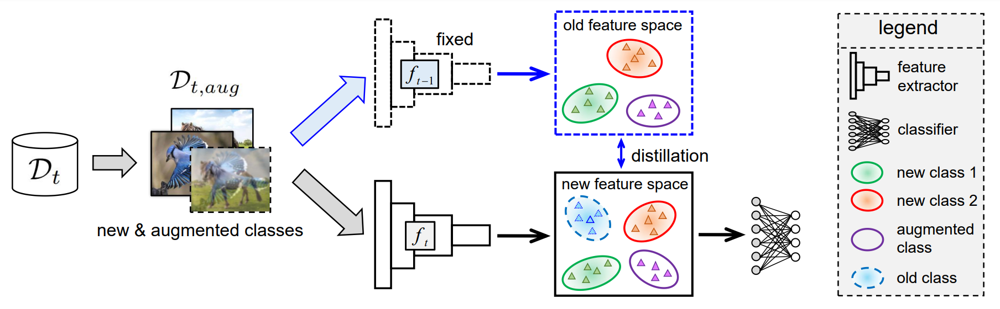

## IL2A - Official PyTorch Implementation


### [NeurIPS2021] Prototype Augmentation and Self-Supervision for Incremental Learning
Fei Zhu, Zhen Cheng, Xu-Yao Zhang, Cheng-Lin Liu<br>
[Paper](https://proceedings.neurips.cc/paper/2021/file/77ee3bc58ce560b86c2b59363281e914-Paper.pdf)
### Usage 
We run the code with torch version: 1.10.0, python version: 3.9.7
* Train CIFAR100
```
cd cifar
python main.py
```
* Train Tiny-ImageNet
```
cd tiny
python main_tiny.py
```


### Citation 
```
@article{zhu2021class,
  title={Class-Incremental Learning via Dual Augmentation},
  author={Zhu, Fei and Cheng, Zhen and Zhang, Xu-Yao and Liu, Cheng-lin},
  journal={Advances in Neural Information Processing Systems},
  volume={34},
  pages={14306--14318},
  year={2021}
}
```

### Contact
Fei Zhu (zhufei2018@ia.ac.cn)

